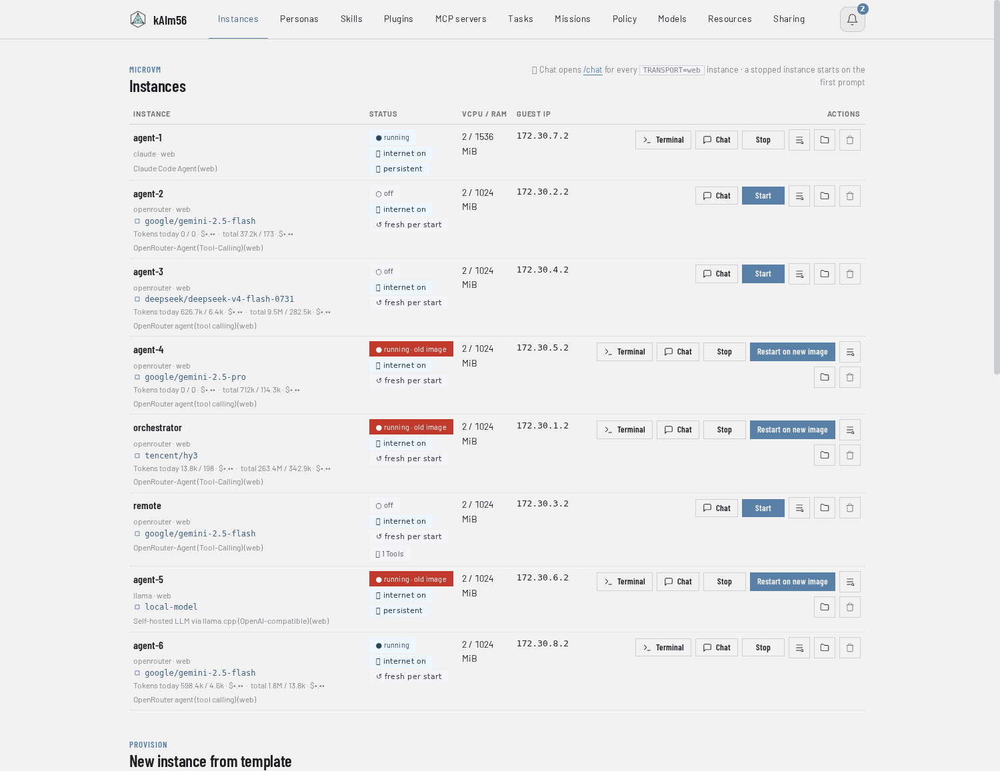
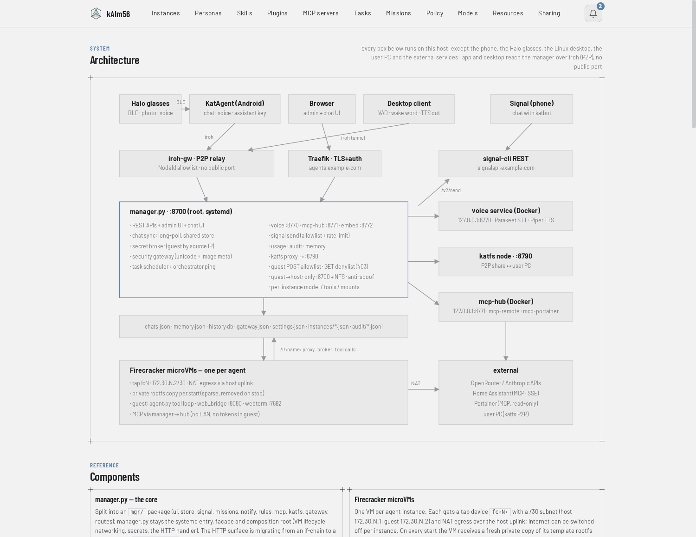

# kAIm56

A workbench for personal AI agents: build, run, watch and constrain them on your
own machine. Every agent runs in its own Firecracker microVM; a single-process
manager on the Python standard library gives it tools, memory, secrets, a schedule,
a policy, traces and a voice. You talk to the agents from an Android app, the
browser, a hands-free desktop client, an ESP32 device or Signal — and the LLM keys
never leave the host. Models are consumed (OpenRouter, a local server), not hosted
or trained here.

```
Phone (app) ──── iroh ──┐
Desktop voice ── iroh ──┤
ESP32 (MrVoice) HTTPS ──┼─► Manager (:8700, web UI + API) ─► microVM per agent ─► LLM / MCP / tools
Browser ─────── HTTPS ──┤         │            │                  ▲
Signal ─────────────────┘         │            └─ STT/TTS · embeddings · MCP hub (host containers)
                                  └── katfs (iroh, P2P) ────────────────┘
```



## How it is built

- **One microVM per agent.** Own kernel, own network (a /30 behind NAT with LAN
  gating), a copy-on-write rootfs with an optional persistent disk. A compromised
  agent is a compromised VM, not a compromised host.
- **A manager, not a stack.** `manager/manager.py` plus a small `mgr/` package —
  standard library only, no framework, no database server, no message broker.
- **Secrets stay on the host.** Agents fetch nothing but what a per-instance policy
  releases; LLM calls are proxied so the API key is injected on egress; MCP servers
  (Home Assistant, calendar, …) run in a hub container on the host and the VM only
  sends JSON-RPC.
- **Everything goes through the manager.** Speech recognition, synthesis,
  embeddings and MCP are host containers on loopback; the guest firewall allows only
  the manager port and NFS. Each VM gets its own NFS workspace and host folders,
  exported to its address alone, with every write mapped to a dedicated system user.
- **No public port for the phone or the desktop.** They reach the manager over iroh
  (P2P, end-to-end encrypted, NodeId allowlist). The browser and the ESP32 use
  HTTPS behind a reverse proxy.

## What the agents can do

Shell, files, HTTP, web search, PDF extraction, scheduled tasks, sub-agents in
ephemeral VMs, missions (multi-step plans that survive restarts and are delegated
across agents), semantic long-term memory, playbooks (standing rules), a skill
catalog, drop-in tool plugins, and per-instance MCP servers — Home Assistant with
deterministic server-side matching for voice commands, CalDAV calendars and tasks,
Portainer, a radio. Human-in-the-loop approval, budgets, rate limits, egress
allowlists and an audit trail sit on every instance.

## Clients

| Client | Where | Transport | Notes |
|---|---|---|---|
| **KatAgent** | Android (`app/`) | iroh | chat, voice, missions, tasks; offline Gemma mode |
| **Web manager + chat** | browser (`manager/`) | HTTPS | instances, tasks, missions, policy, secrets, plugins, MCP, architecture |
| **Desktop voice client** | Linux topbar (`voice-client/`) | iroh, tunnel embedded | energy VAD, two-stage wake word incl. a local own-voice model, sentence-streamed replies |
| **MrVoice** | ESP32-S3 device (`espclient/`) | HTTPS | push-to-talk; INMP441 mic, MAX98357A amp, one button |
| **Signal** | phone | signal-cli | messages trigger the agent; approvals come back the same way |

Voice conversations appear live in the web chat as sessions; `/reset` archives one
and starts the next.



## Getting started

Requirements: Linux x86_64 with KVM (`/dev/kvm`), Docker, Python ≥ 3.9, systemd.

```bash
git clone https://github.com/uneidel/kaim56 && cd kaim56
./install.sh --check                           # prerequisites only
VMLINUX_URL=<release-asset-url> ./install.sh --with-voice
```

The installer lays out the runtime tree, downloads Firecracker and the guest
kernel, builds the agent rootfs and the host containers, installs the systemd
service and runs a smoke test. It is idempotent. Afterwards: web UI on port 8700,
Settings tab, add an API key, create an instance from a template.

Running the manager by hand instead: `manager/README.md` (config files, NFS share,
templates, the policy and secret model).

## Repository

| Path | Contents |
|---|---|
| `manager/` | The manager: `manager.py` (routes, VM lifecycle, networking, secrets), `mgr/` (store, missions, notify, rules, mcp, katfs, gateway, routes, …), `chatui.py`, `webterm.py`, `templates/`, tests |
| `agents/` | Guest images: build scripts and the in-VM agent for `openrouter/` and `claude/` |
| `app/` | KatAgent, the Android app (Kotlin/Compose, builds in Docker) |
| `voice-client/` | Desktop voice client (Go, one static binary) |
| `espclient/` | MrVoice, the ESP32-S3 client (ESP-IDF via PlatformIO) |
| `katfs/` | Browser-to-agent folder sharing over iroh (Rust, WASM) |
| `iroh-gw/` | The iroh transport: host gateway and desktop tunnel (Rust); prebuilt in `dist/` |
| `voice/`, `embed/`, `mcp-hub/` | Host containers: speech (Parakeet + Piper), embeddings, MCP server processes |
| `examples/` | Templates for the files kept out of the repo (settings, site, MCP catalog) |
| `docs/` | Screenshots, project page |

Per-client details live next to the code: `app/README.md`, `voice-client/README.md`,
`espclient/Readme.md` (wiring) and `espclient/CLAUDE.md` (behaviour), `katfs/README.md`.

## Development

- `manager/run-tests.sh` — the stdlib-only test suite in three tiers (unit, HTTP
  against the running manager, live against a VM) plus gates for undefined names
  and the web UI's JavaScript syntax. Green is the bar for every change.
- `CLAUDE.md` — working conventions for humans and agents: the two-tree setup (live
  system vs. repo), the update cycle, what never goes into the tree.
- `manager/CHANGELOG.md` — one line per change, newest first.
- `agents/openrouter/build-openrouter-rootfs.sh --smoke <instance>` rebuilds the
  agent image and proves it on one instance without a model call; the Instances
  tab flags VMs still running an older image.

## License

kAIm56 is licensed under the **GNU Affero General Public License v3.0
(AGPL-3.0-or-later)** — see [LICENSE](LICENSE). You may use, modify and self-host it;
if you run it as a network-accessible service, modified or not, you must make your
version's source available to its users. Copyright (C) 2026 the kAIm56 authors.

Third-party notes: the Python parts are standard-library only. The Rust parts
(`katfs/`, `iroh-gw/`) pull MIT/Apache-2.0 crates at build time (iroh, tokio,
serde, anyhow, tiny_http); distributing built binaries requires their notices. The
desktop client depends on `fyne.io/systray`; the ESP32 client uses stock ESP-IDF.
Adapted concepts: context/harness patterns from strands-agents/harness-sdk
(Apache-2.0), `/model`, steering, prompt templates, plugins and the oracle tool from
pi.dev, the credential-injection gateway from OneCLI, and the invisible-Unicode
scrubber in `manager/text_unicode.py` from guillaumemeyer/watermarks-remover (MIT).
