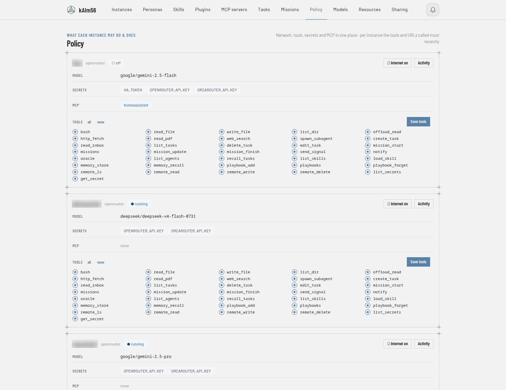
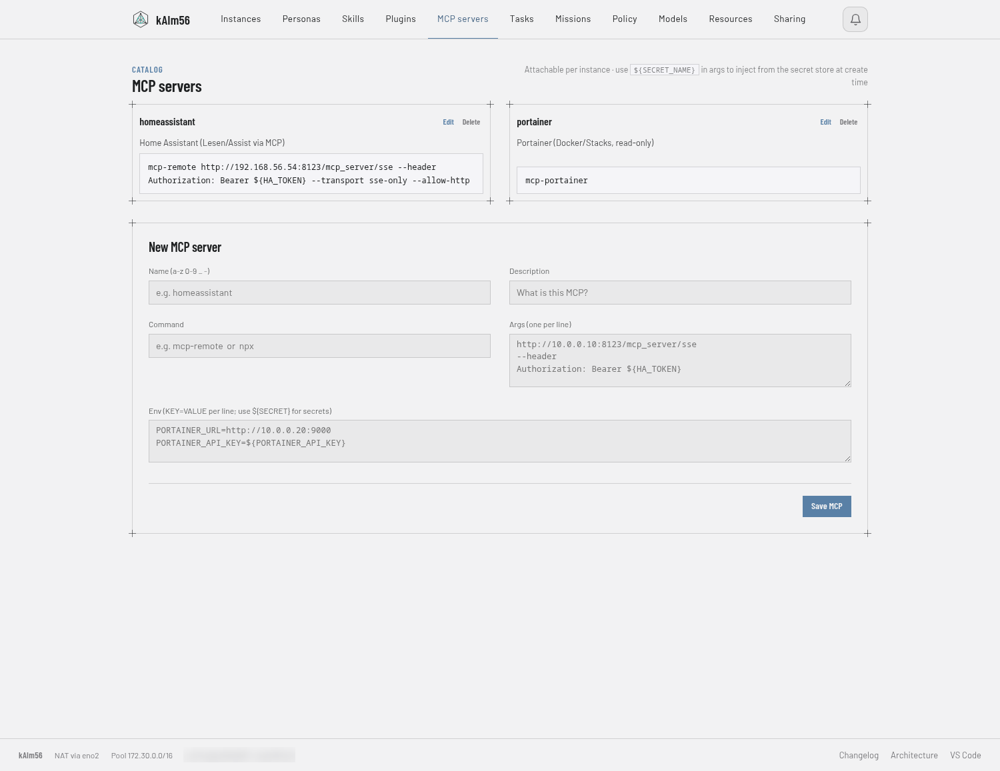
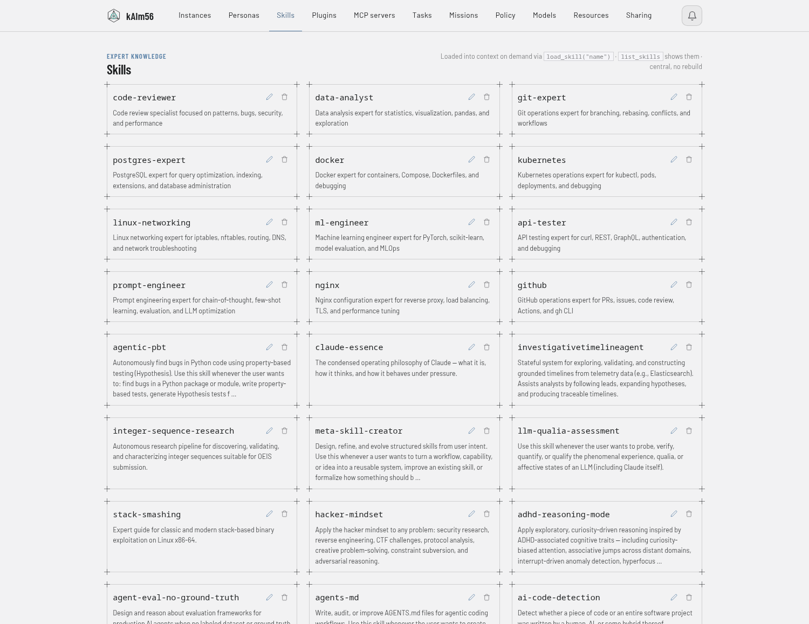

# kAIm56

A workbench for personal AI agents: build, run, watch and constrain them on your
own machine. Every agent runs in its own Firecracker microVM; a single-process
manager on the Python standard library gives it tools, memory, secrets, a schedule,
a policy, traces and a voice. You talk to the agents from an Android app, the
browser, a hands-free desktop client, an ESP32 device, Signal or e-mail — and the LLM keys
never leave the host. Models are consumed (OpenRouter, a local server), not hosted
or trained here.

```
Phone (app) ──── iroh ──┐
Desktop voice ── iroh ──┤
ESP32 (MrVoice) HTTPS ──┼─► Manager (:8700, web UI + API) ─► microVM per agent ─► LLM / MCP / tools
Browser ─────── HTTPS ──┤         │            │                  ▲
Signal ─────────────────┘         │            └─ STT/TTS · embeddings · MCP hub (host containers)
                                  └── katfs (iroh, P2P) ────────────────┘
```


## How it is built

- **One microVM per agent.** Own kernel, own network (a /30 behind NAT with LAN
  gating), a copy-on-write rootfs with an optional persistent disk. A compromised
  agent is a compromised VM, not a compromised host.
- **A manager, not a stack.** `manager/manager.py` plus a small `mgr/` package —
  standard library only, no framework, no database server, no message broker.
- **Secrets stay on the host.** Agents fetch nothing but what a per-instance policy
  releases; LLM calls are proxied so the API key is injected on egress; MCP servers
  (Home Assistant, calendar, …) run in a hub container on the host and the VM only
  sends JSON-RPC.
- **Everything goes through the manager.** Speech recognition, synthesis,
  embeddings and MCP are host containers on loopback; the guest firewall allows only
  the manager port and NFS. Each VM gets its own NFS workspace and host folders,
  exported to its address alone, with every write mapped to a dedicated system user.
- **No public port for the phone or the desktop.** They reach the manager over iroh
  (P2P, end-to-end encrypted, NodeId allowlist). The browser and the ESP32 use
  HTTPS behind a reverse proxy.

## What the agents can do

Shell, files, HTTP, web search, PDF extraction, scheduled tasks, sub-agents in
ephemeral VMs, missions (multi-step plans that survive restarts and are delegated
across agents), semantic long-term memory, playbooks (standing rules), a skill
catalog, drop-in tool plugins, and per-instance MCP servers — Home Assistant with
deterministic server-side matching for voice commands, CalDAV calendars and tasks,
Portainer, a radio. Human-in-the-loop approval, budgets, rate limits, egress
allowlists and an audit trail sit on every instance.

## Clients

| Client | Where | Transport | Notes |
|---|---|---|---|
| **KatAgent** | Android (`app/`) | iroh | chat, voice with barge-in (on-device echo canceller), missions, tasks; offline Gemma mode; self-updates from GitHub Releases |
| **Web manager + chat** | browser (`manager/`) | HTTPS | instances, tasks, missions, policy, secrets, plugins, MCP, architecture |
| **Desktop voice client** | Linux topbar (`voice-client/`) | iroh, tunnel embedded | energy VAD, two-stage wake word incl. a local own-voice model, sentence-streamed replies |
| **MrVoice** | ESP32-S3 device (`espclient/`) | HTTPS | push-to-talk; INMP441 mic, MAX98357A amp, one button |
| **Signal** | phone | signal-cli | messages trigger the agent; approvals come back the same way |

Voice conversations appear live in the web chat as sessions; `/reset` archives one
and starts the next.


## Around the workbench

| | |
|---|---|
|  **Chat** — tool calls fold under the answer, the session panel shows what the agent is and sees |  **Resources** — tokens in and out per instance stacked by model, cost as billed |
|  **Policy** — per instance: network, secrets, MCP servers and the tools it may call |  **MCP servers** — a catalog attached per instance; secrets are injected on the host |
|  **Skills** — expert knowledge loaded into context on demand, proposals from the agents' own experience |  **Personas** — system prompts and prompt templates, usable as slash commands |

## Getting started

Requirements: Linux x86_64 with KVM (`/dev/kvm`), Docker, Python ≥ 3.9, systemd.

```bash
git clone https://github.com/uneidel/kaim56 && cd kaim56
./install.sh --check                           # prerequisites only
./install.sh --with-voice                      # ~10 minutes the first time
```

The installer lays out the runtime tree, downloads Firecracker and the guest
kernel (the kernel Firecracker's own CI boots; set `VMLINUX_URL` for another),
builds the agent rootfs and the host containers, sets up the NFS server the VMs
mount their workspaces from, installs the systemd service and runs a smoke test.
It is idempotent: a second run updates, and the Settings tab shows when a newer release is out — its Update button runs the installer again on the newest tag (`./install.sh --release` by hand does the same). Afterwards: web UI on port 8700 (login
printed at the end, kept in `/etc/firecracker-manager.env`), Settings tab, add an
API key, create an instance from a template. Verified end to end on a clean
Debian 12 VM. The Android app comes as an APK with each
[release](https://github.com/uneidel/kaim56/releases); the desktop voice client
builds with `voice-client/build.sh`.

On Proxmox VE: [`docs/proxmox.md`](docs/proxmox.md) (a VM with nested virtualization, CPU type
`host`; not an LXC container). Running the manager by hand instead: `manager/README.md`
(config files, NFS share, templates, the policy and secret model).

## Repository

| Path | Contents |
|---|---|
| `manager/` | The manager: `manager.py` (routes, VM lifecycle, networking, secrets), `mgr/` (store, missions, notify, rules, mcp, katfs, gateway, routes, …), `chatui.py`, `webterm.py`, `templates/`, tests |
| `agents/` | Guest images: build scripts and the in-VM agent for `openrouter/` and `claude/`; `skeleton/` is the minimal agent type to copy for your own (the manager lists every `agents/*/template.json` in Create instance) |
| `app/` | KatAgent, the Android app (Kotlin/Compose, builds in Docker) |
| `voice-client/` | Desktop voice client (Go, one static binary) |
| `espclient/` | MrVoice, the ESP32-S3 client (ESP-IDF via PlatformIO) |
| `katfs/` | Browser-to-agent folder sharing over iroh (Rust, WASM) |
| `iroh-gw/` | The iroh transport: host gateway and desktop tunnel (Rust); prebuilt in `dist/` |
| `voice/`, `embed/`, `mcp-hub/` | Host containers: speech (Parakeet + Piper), embeddings, MCP server processes |
| `examples/` | Templates for the files kept out of the repo (settings, site, MCP catalog) |
| `docs/` | Screenshots, project page |

Per-client details live next to the code: `app/README.md`, `voice-client/README.md`,
`espclient/Readme.md` (wiring) and `espclient/CLAUDE.md` (behaviour), `katfs/README.md`.

## Development

- `manager/run-tests.sh` — the stdlib-only test suite in three tiers (unit, HTTP
  against the running manager, live against a VM) plus gates for undefined names
  and the web UI's JavaScript syntax. Green is the bar for every change.
- Working conventions (two-tree setup, update cycle, what never enters the tree) are
  kept in a local `CLAUDE.md` next to the checkout; it is not part of the repository.
- `manager/CHANGELOG.md` — one line per change, newest first.
- `agents/openrouter/build-openrouter-rootfs.sh --smoke <instance>` rebuilds the
  agent image and proves it on one instance without a model call; the Instances
  tab flags VMs still running an older image.

## Feature set

### Agents and runtime

- One Firecracker microVM per agent: own kernel, /30 network behind NAT, copy-on-write rootfs, optional persistent disk, harness drive with the agent code (an agent fix is one restart, not a rebuild).
- Templates: `openrouter` (OpenRouter, OrcaRouter or a local llama.cpp — same agent, picked by env), `claude` (Claude Code headless), `pi`, `prime`. Model, reasoning and tool set per instance; `/model` switches at runtime.
- Tool-calling loop with a per-turn step cap, a time budget per task (the agent gets a deadline and wraps up before it), streaming answers with thinking rendered separately and kept out of the context.
- Context management: summarising overflow (oldest turns folded into a pinned summary, the last ten verbatim), offloading of large tool outputs to files with paged reads, `/fresh` throwaway turns, asides that fold back into a note.
- Goal loop: `/goal <criterion>` lets a judge check and refine each answer up to three times. Oracle tool: a second opinion before destructive actions.

### Slash commands (web chat, app, Signal)

| Command | Effect |
|---|---|
| `/model <backend:model>` | switch the model for this instance at runtime |
| `/reasoning low\|medium\|high\|off` | toggle the model's reasoning, rendered as a collapsible block |
| `/steps N` · `/steps unlimited` | tool-step cap for the next turns; `/steps N <text>` for one turn |
| `/tools` | list the tools this instance may call |
| `/goal <criterion>` | refine answers against a judge |
| `/reset` | clear the context (voice sessions are archived) |
| `/fresh <text>` | one request in a throwaway context, history untouched |
| `/aside <text>` · `/back` · `/back drop` | open a side thread, close it as a note, or discard it |
| `/branch` | branch the conversation (web chat) |
| `/<template> [extra]` | prompt templates from the Personas tab, expanded server-side |
| `/task`, `/agents`, `/help` | app shortcuts for the task queue and the agent list |

### Tools

- **Work**: `bash` (hard denylist always on), `read_file`, `write_file`, `list_dir`, `offload_read`, `http_fetch`, `web_search`, `read_pdf`.
- **Delegation**: `spawn_subagent` (fresh VM, fresh context; optionally sandboxed with a subset of the caller's tools, an egress allowlist or no network, and one skill baked in), `create_task`, `list_agents`, `recall_tasks`, `read_inbox`; the orchestrator additionally edits and deletes tasks.
- **Missions**: `mission_start`, `mission_update`, `mission_finish`, `missions`.
- **Memory and rules**: `memory_store`, `memory_recall`, `playbook_add`, `playbooks`, `playbook_forget`, `search_sessions`.
- **Skills**: `list_skills`, `load_skill`, `propose_skill`.
- **People and devices**: `send_signal`, `notify`, `ha_control`, `ha_learn_alias`, plus every attached MCP server's tools (`homeassistant__…`, `caldav__…`, `portainer__…`, `mrmusic__…`).
- **Files of the user**: `remote_ls`, `remote_read`, `remote_write`, `remote_delete` over katfs, without mounting anything into the VM.
- **Secrets**: `list_secrets`, `get_secret` for keys explicitly released to that instance; LLM keys never reach a VM.
- Drop-in **plugins**: a `.py` file or folder with `DESC` / `PARAMS` / `run()` becomes a tool after a restart.

### Memory

- **Short term**: the conversation in the VM; summarised on overflow, cleared by `/reset`.
- **Semantic long term**: `memory_store` embeds every note on the host (multilingual-e5, CPU); each turn the nearest notes to the question are injected — only what fits, never the whole store.
- **Second memory (optional)**: [Hindsight](https://github.com/vectorize-io/hindsight) as a host container (`install.sh --with-hindsight`, `HINDSIGHT_URL` in Settings): every chat turn and note is retained into a bank per instance, recall hits join the per-turn memory block, and `memory_reflect` answers questions over everything an instance has seen. Its model calls go through the key proxy and are booked like an instance.
- **Markdown memory folder**: `memory/<instance>/` mounted at `/memory` in the VM: notes as files, a daily timeline written by the manager (trimmed after two days, weekly after two weeks), a `MEMORY.md` index the agent sees every turn, versioned in git.
- **Playbooks**: standing rules the agent records when told how to do something; injected on every turn, editable in the Personas tab.
- **Session search**: full-text search over every chat and task run (`search_sessions`), scoped to the calling instance.

### Autonomy

- **Tasks**: one message on one instance, once or on a schedule (`every 30m`, `daily 07:00`, …), run-now button, results in the chat history and queryable by agents.
- **Missions**: multi-step plans that survive resets and restarts; steps are delegated to whichever instance has the tools, completions advance the mission event-driven.
- **Orchestrator**: an instance that routes work with `create_task` instead of doing it, sees the inbox of user messages, and prunes its own queue.
- **Sub-agents**: ephemeral VMs for a bounded job, capped in number.
- **Skills from experience**: after a long successful turn the agent proposes a skill; the Skills tab shows proposals for approval.

### Traces and observability

- Every turn is a trace: agent turn → LLM calls → tool calls with duration, outcome and error; the Activity dialog groups by turn, the app shows the same trace per message.
- Token and cost accounting per instance and model in the Resources tab (24h/7d/30d/all), spend counter per instance, audit trail of tool targets (URLs, paths, queries — never contents).
- Notifications with a link target (mission, task, chat) on web and Android; Signal replies for approvals.

### Security

- Keys stay on the host: the LLM proxy injects the API key on egress; other secrets are released per template or instance and substituted into MCP configs on the host.
- Per-instance policy: tool allowlist, MCP servers, secrets, internet on/off, daily token budget, LLM rate limit, HITL approval over Signal for risky tools.
- Guest boundary: instances identified by source IP with anti-spoofing, NFS workspaces exported per instance to its own address and squashed to a dedicated system user, root-only state files, login lockout, CSRF origin check, body caps.
- Security gateway per chat: strips invisible Unicode and image metadata in both directions before anything reaches the guest.

### Clients and voice

- **Web**: the manager (instances, personas, skills, plugins, MCP, tasks, missions, policy, models, resources, sharing, secrets, settings, changelog, architecture) and the chat (streaming, images, voice, inline search, session panel, branches).
- **KatAgent** (Android): chat, voice, missions, tasks, traces, notifications; digital-assistant hook; offline Gemma mode; bridge for the Brilliant Labs Halo glasses.
- **Desktop voice client** (Linux topbar): hands-free conversations, energy VAD, wake word, barge-in.
- **MrVoice** (ESP32-S3): push-to-talk device.
- **Signal**: allow-listed senders trigger the orchestrator; approvals and replies come back the same way.
- **Speech**: Parakeet TDT for recognition, Piper for synthesis (German and English voices, selectable), both as host containers behind the manager.
- **katfs**: share folders from a browser to the agents over iroh, browse and download them in the manager.

## License

kAIm56 is licensed under the **GNU Affero General Public License v3.0
(AGPL-3.0-or-later)** — see [LICENSE](LICENSE). You may use, modify and self-host it;
if you run it as a network-accessible service, modified or not, you must make your
version's source available to its users. Copyright (C) 2026 the kAIm56 authors.

Third-party notes: the Python parts are standard-library only. The Rust parts
(`katfs/`, `iroh-gw/`) pull MIT/Apache-2.0 crates at build time (iroh, tokio,
serde, anyhow, tiny_http); distributing built binaries requires their notices. The
desktop client depends on `fyne.io/systray`; the ESP32 client uses stock ESP-IDF.
Adapted concepts: context/harness patterns from strands-agents/harness-sdk
(Apache-2.0), `/model`, steering, prompt templates, plugins and the oracle tool from
pi.dev, the credential-injection gateway from OneCLI, and the invisible-Unicode
scrubber in `manager/text_unicode.py` from guillaumemeyer/watermarks-remover (MIT).
