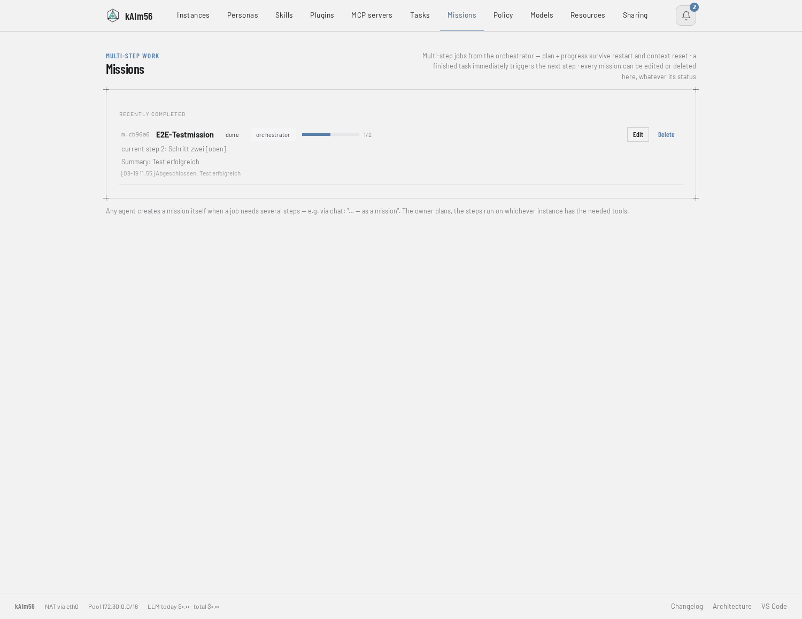

# kAIm56

Monorepo for the agent platform: a **manager** runs agents in their own
Firecracker microVMs; an **Android app**, a **web UI**, a hands-free **desktop
voice client**, a push-to-talk **ESP32 device** and **Signal** talk to them; and
**katfs** hands folders from the browser to the agents over P2P.

```
Phone (app) ──── iroh ──┐
Desktop voice ── iroh ──┤
ESP32 (MrVoice) HTTPS ──┼─► Manager (:8700, web UI + API) ─► microVM per agent ─► LLM / MCP / tools
Browser ─────── HTTPS ──┤         │            │                  ▲
Signal ─────────────────┘         │            └─ STT/TTS · embeddings · MCP hub (host containers)
                                  └── katfs (iroh, P2P) ────────────────┘
```

## Screenshots

The web manager — one microVM per agent, live model/backend, per-instance usage
(instance names and cost figures blurred here):


The built-in **Architecture** view (rendered from the running manager):


**Missions** — multi-step plans the orchestrator drives autonomously:



## Features

**Architecture**
- Self-hosted AI-agent platform — one hardened Firecracker microVM per agent (own kernel, fully isolated)
- Single-process manager (Python standard library only, no framework, no external services) serving the control API, web UI, and chat
- Copy-on-write overlay rootfs: a shared read-only base plus a per-instance write layer
- Optional persistent disk per instance — installed packages and files survive restarts; one-click factory reset
- Automatic per-agent networking: tap devices, /30 subnets, NAT, and LAN gating via iptables
- One-command installer (`curl … | sh`) that provisions the whole stack on a fresh KVM host

**Models & agents**
- Pluggable backends — OpenRouter, OrcaRouter, and self-hosted llama.cpp — selected per instance
- Switch model or provider live during a conversation (`/model`), no restart, context preserved
- Reasoning toggle with a collapsible "thinking" view in web and app
- Orchestrator agent that routes work to capable instances instead of doing it itself
- Claude Code available headless as a first-class agent

**Agent capabilities**
- Built-in tools: shell, files, HTTP fetch, web search, PDF extraction, task scheduling, and sub-agents — `spawn_subagent` runs a self-contained task in a fresh ephemeral VM, optionally on a model of the caller's choice
- Every turn carries the current date and time in the host's zone (`[Now]` line), so "today", "this week" and calendar math need no tool; guests boot with the host's `TZ`
- Missions — multi-step plans with progress that survives resets and restarts. Cross-instance: every agent may own one and delegate its steps to whichever instance has the needed tools; finished tasks are collected per owner and advance the mission in one push
- Semantic long-term memory (embeddings, per-query recall) plus flat key/value memory
- Playbooks — standing rules the agent learns from your corrections and always follows
- Prompt templates as slash commands, auto-summarizing context, and large-output offloading with type-aware previews (JSON becomes an outline, logs get duplicates folded and error lines kept — the full text stays readable via `offload_read`)
- Skills — expert documents in the Claude-Code skill format, pulled into context on demand (`list_skills` names-only, descriptions via query); the repo ships a small catalog, the live system runs 67 imported ones
- Steering (interrupt a running turn), goal loops with a judge, and tree-chat (`/aside` … `/back` folds a side-question back into a one-line note; `/branch` stays as an alias)
- Drop-in tool plugins (pi.dev-style) — add a tool as a single `.py` or a multi-file folder via drag-and-drop in the web UI, no image rebuild; each plugin is SHA-256 content-pinned (out-of-band edits show as "modified" until re-approved) and every file name opens the file in the host's VS Code (code-server)
- Tolerant tool dispatch: a model that drops an MCP server prefix ("mrmusic_power" for "mrmusic__mrmusic_power") still hits the tool when the short name is unique; `/tools` lists the registry without a model call

**Communication**
- Signal integration — receive and send, incoming messages trigger the agent
- Push notifications to the mobile app and a web bell, clickable straight to the relevant chat
- Voice — speech-to-text (Parakeet TDT v3) and text-to-speech (Piper) as one host container with selectable voices and speed; the manager filters tool status, think blocks and markdown out of everything that is read aloud
- Peer-to-peer folder sharing (iroh) from the browser or a native CLI, with ZIP download
- Per-instance MCP servers via a host-side hub — Home Assistant, Portainer, a radio, and CalDAV (calendar events and tasks; times arrive in local time, event creation accepts plain local datetimes); assigned per instance in the Policy tab, secrets substituted on the host
- Voice-controlled Home Assistant with server-side matching (`ha_control`): exact name or alias, then room plus a group word, then fuzzy — mishearings are learned as HA aliases

**Clients & UI**
- Web manager: instances, tasks, missions (editable and deletable in any state), personas, playbooks, prompt templates, policy (tools, secrets, MCP per instance), models, sharing, secrets, settings, architecture
- Android app **KatAgent** (chat, voice, missions, tasks, an offline on-device Gemma mode); reaches the manager over iroh — no VPN, no public port, NodeId allowlist
- **Desktop voice client** (`voice-client/`, one static Go binary in the GNOME/KDE topbar): energy VAD, a two-stage wake word — transcript check, or a local own-voice model (MFCC/DTW, enrolled in 30 s) that keeps audio on the desktop until the word is heard — sentence-streamed replies, the iroh tunnel embedded in the binary
- **ESP32 voice device** MrVoice (`espclient/`): push-to-talk on a Seeed XIAO ESP32-S3 with the same four manager endpoints over HTTPS
- Signal as a client: incoming messages trigger the agent, replies and approvals go back the same way
- Conversations from the voice clients appear live in the web chat as voice sessions; `/reset` archives the session and starts a new one
- Streaming web chat with Markdown, vision/image input, read-aloud, and a slash-command picker
- Per-instance activity view with time filtering and token/cost usage; last speech transcripts and uploads inspectable for debugging a client (`/api/stt-recent`)

**Glasses (in progress)**
- Client for the Brilliant Labs Halo/Frame glasses in the Android app: BLE message protocol ported to Kotlin, device-side Lua app on the SDK's unmodified modules, voice command → glasses camera → image to the agent → reply on the display
- Everything except the Bluetooth transport is proven without hardware: JVM tests for the protocol, the vendor's emulator for the device side (which caught real bugs — ASCII-only source, display geometry), a dry-run mode in the app

**Security & guardrails**
- Secret broker — API keys never touch a VM's disk, gated by source-IP allowlists
- Credential-injection gateway — LLM keys never enter a VM; the manager injects them on egress
- Human-in-the-loop approval for risky tools via Signal
- Hard shell denylist plus an "oracle" second opinion required before destructive actions
- Content gateway — strips invisible-Unicode injection and image metadata, per chat
- Cost and rate circuit breakers — per-instance daily token budget and calls-per-minute
- Task-frequency cap and orphaned-run recovery; task targets are validated when a task is created, a failing scheduled task pushes a notification, tasks whose instance disappeared are reported by an hourly sweep
- Per-instance egress allowlist and a secret leak-filter on outgoing messages
- Per-instance tool allowlists and a per-instance audit trail
- Guest boundary — VMs are identified by source IP (anti-spoof rule per tap), may POST only an allowlist and may not GET the admin UI, chat, katfs or another instance's proxy/terminal; the roster, task history, approval ids and inbox they see are scoped to them
- Delegation policy — an agent may task only itself, an ephemeral VM, or the instances in its `DELEGATE_TARGETS`; host firewall lets guest traffic reach only the manager port and NFS
- HTTP surface moving from an if-chain to a routing table where exact paths beat prefixes and every route carries whether a guest VM may call it — enumerable for audits, with a test that guards the remaining chain against shadowed routes

**Operations**
- Instances running on an outdated base image are flagged in the Instances tab ("running · old image") with a one-click restart; a rebuild pushes a notification naming the affected instances
- `build-openrouter-rootfs.sh --smoke <instance>` restarts one instance on the new image and checks its tool registry (`/tools`) without a model call
- 129 stdlib-only tests (`manager/run-tests.sh`): unit, HTTP against the running manager, live against a VM; gates for undefined names and for the web UI's JavaScript syntax

## Layout

| Path | Contents |
|---|---|
| `manager/` | Manager: `manager.py` (web UI + API + VM lifecycle), `chatui.py` (`/chat`), `webterm.py` (browser terminal), `templates/` (agent templates), systemd unit, `logo.svg` |
| `app/` | **KatAgent** (Android, Kotlin/Compose): chat with server agents + a local Gemma model. Builds without a local Android SDK via `Dockerfile.build` |
| `katfs/` | Browser-to-agent folder sharing over iroh (P2P): `node/` + `client/` (Rust), `web/` (WASM bridge), `PROTOCOL.md` |
| `agents/` | Build scripts and guest bridges for the microVM images: `claude/`, `openrouter/`, … |
| `voice-client/` | Desktop voice client (Go): topbar icon, VAD, two-stage wake word, sentence-streamed TTS, embedded iroh tunnel; `go test` covers it without a microphone |
| `iroh-gw/` | The iroh transport (Rust): `iroh-gw` on the host relays app/desktop streams to the manager, `kaim56-tunnel` is the desktop side; prebuilt binaries in `dist/` |
| `voice/` | Speech service container: Parakeet TDT v3 (ONNX) for recognition, Piper for synthesis, loopback-only behind the manager |
| `embed/` | Embedding service container for the semantic memory, loopback-only behind the manager |
| `mcp-hub/` | MCP hub container: the MCP server processes run here once per (instance, server), never in a VM; `patch-caldav.js` holds the build-time fixes for caldav-mcp |
| `docs/` | Screenshots and the project page |
| `espclient/` | **MrVoice** — push-to-talk voice client on a Seeed XIAO ESP32-S3 (ESP-IDF 5.4 via PlatformIO, stock IDF only): INMP441 mic, MAX98357A amp, button; talks to the manager over HTTPS with the same four endpoints as the desktop client; 50 host-side unit tests |
| `examples/` | Templates for the files intentionally kept out of the repo |

## Running the manager

```bash
cd manager
cp ../examples/settings.example.json settings.json   # add API keys (chmod 600)
cp ../examples/site.example.json     site.json       # your domain / DNS / uplink NIC
cp ../examples/mcp-catalog.example.json mcp-catalog.json  # optional: your MCP endpoints
sudo python3 manager.py                              # or via firecracker-manager.service
```

Requires on the host: `bin/firecracker` + `bin/vmlinux`, the rootfs images under
`instances/`, and the NFS share (`setup-nfs-host.sh`). Details in `manager/README.md`.

## Building the app

```bash
cd app
docker build -f Dockerfile.build -t katagent-build .
docker run --rm -v "$PWD":/project -v katagent-gradle:/root/.gradle katagent-build \
  gradle assembleDebug --no-daemon --console=plain
# -> app/build/outputs/apk/debug/app-debug.apk
```

## katfs

`katfs/node` (host gateway) and `katfs/client` are Rust crates; `katfs/web` is the
WASM bridge for browser sharing. Protocol: `katfs/PROTOCOL.md`.

## Tool plugins

Give an agent a new tool without rebuilding anything. A plugin is either a single
`.py` file or a **folder** (multi-file projects — each tool gets its own folder),
following one convention:

```python
DESC = "what the tool does (shown to the model)"
PARAMS = {"text": {"type": "string", "description": "an argument"}}
REQUIRED = []

def run(text=""):
    return f"ok: {text}"          # return a string
```

Manage them in the web UI's **Plugins** tab: drag a `.py`/`.zip` onto the drop zone,
or generate a boilerplate. Files live under `manager/plugins/<name>/`, ride the
per-instance config disk into the microVM, and are loaded at agent start (the VM is
the sandbox; stdlib only). A tool's folder is put on `sys.path`, so intra-folder
imports (`import helper`) work. Restart an instance to activate a new plugin. The
mechanism is adapted from **pi.dev**'s extension idea.

## Changes

`manager/CHANGELOG.md` tracks the platform's history.

## Installing on a fresh machine

Requirements: Linux x86_64 **with KVM** (`/dev/kvm`), Docker, Python ≥ 3.9, systemd.

```bash
# from a clone:
./install.sh --check          # only check prerequisites
VMLINUX_URL=<release-asset-url> ./install.sh --with-voice

# or the classic way (once the repo is public):
curl -fsSL https://raw.githubusercontent.com/uneidel/kaim56/main/install.sh | sh
```

The installer lays out the runtime tree under `$KAIM56_BASE` (default `$HOME`),
downloads the Firecracker binary (v1.16.1) from GitHub, fetches the guest kernel
(`VMLINUX_URL` — publish it as a release asset), builds the openrouter rootfs plus
the embedding/MCP-hub containers (`--with-voice`, `--with-agents` optional), sets up
the systemd service with a generated password, and runs a smoke test. Idempotent —
run again to update. Then: web UI on port 8700 → Settings tab → add an API key.

## License

kAIm56 is licensed under the **GNU Affero General Public License v3.0 (AGPL-3.0-or-later)** — see [LICENSE](LICENSE).

In short: you may use, modify, and self-host the software. **If you run it (modified
or not) as a network-accessible service, you must make your version's source
available to its users.** This keeps kAIm56 open across forks and deployments — a
closed-source SaaS built on it is not permitted.

Copyright (C) 2026 the kAIm56 authors. The Android app (`app/`) is under the same license.

### Third-party / attribution
The Python part (manager + agent) is **standard-library only**, with no bundled
third-party code.

**katfs** and **iroh-gw** (Rust, `katfs/`, `iroh-gw/`) are original code (AGPL like the rest) but use crates from
crates.io — not vendored in the repo, pulled at build time: **iroh** (P2P), **tokio**,
**serde**/**serde_json**, **anyhow**, **tiny_http**. The desktop voice client (Go) depends only on **fyne.io/systray**; the ESP32 client uses stock ESP-IDF. These are permissively licensed
(MIT or Apache-2.0) and compatible with the AGPL. Anyone distributing a **built katfs
binary** must include those crates' copyright/license notices (the usual MIT/Apache
requirement for binary distribution); see each crate's repository for exact terms.

Adapted **concepts** (not copied verbatim):
- Context/harness patterns (summarizing, context offloader, goal loop, interventions)
  informed by **strands-agents/harness-sdk** (Apache-2.0); the summarization prompt is
  the only near-verbatim piece.
- `/model`, steering, prompt templates, tool plugins, and the oracle tool: ideas from **pi.dev**.
- Credential-injection gateway: pattern from **OneCLI**.
- Security-gateway text scrubber (invisible-Unicode / watermark carrier removal, Layer A): `manager/text_unicode.py` is adapted from **guillaumemeyer/watermarks-remover** (MIT) and extended (Unicode noncharacters + reserved default-ignorables); the statistical/LLM and pixel-ML layers of that project are deliberately not included.
